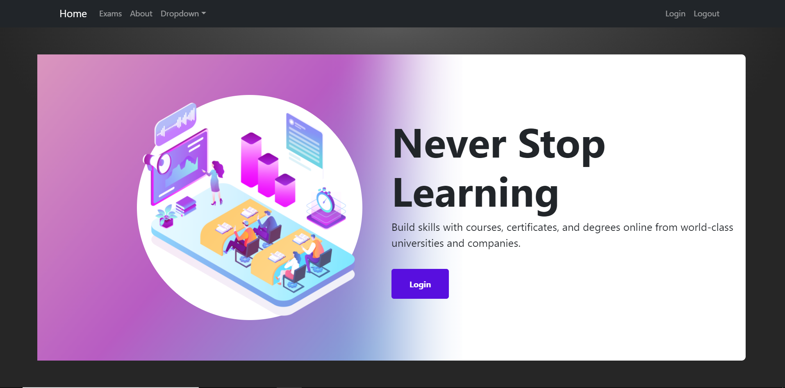
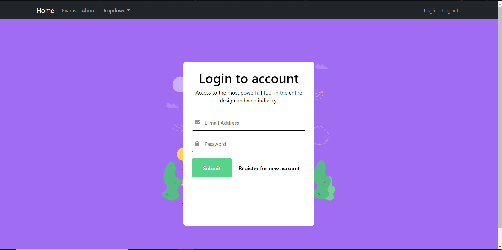
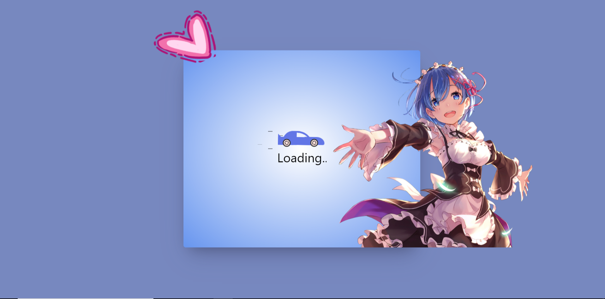
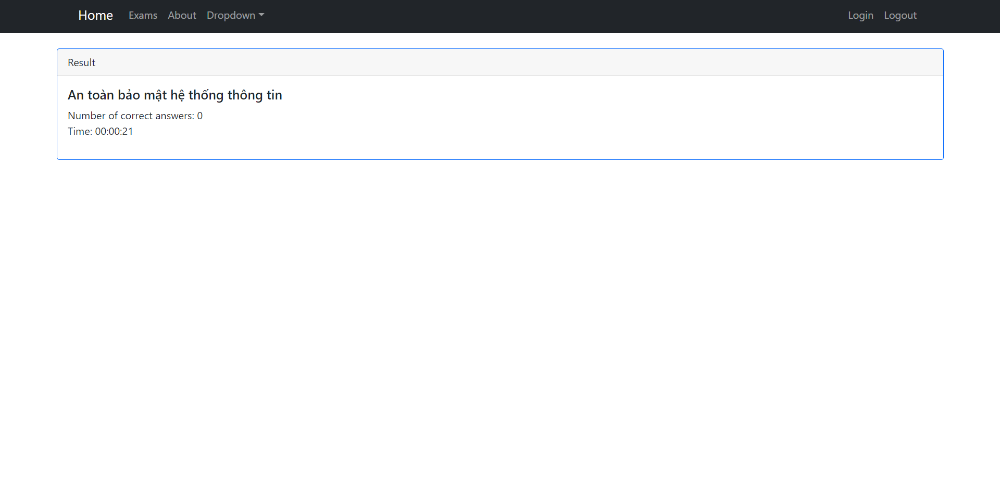

# Exam making app

## Description

- My motivation for building this project is to allow student can take exam online
- It helps me practice using nodejs(express) and json web token, reactjs
- App can check login, load exam, and check answer
- I learned how to use jwt adn create rest api, front-end skill with html, css, reactjs

## Usage

Demo: https://61fa0f649cd79f954e3b5f1b--multichoice-exam-web.netlify.app/

    ```md
    
    
    
    
    ```

